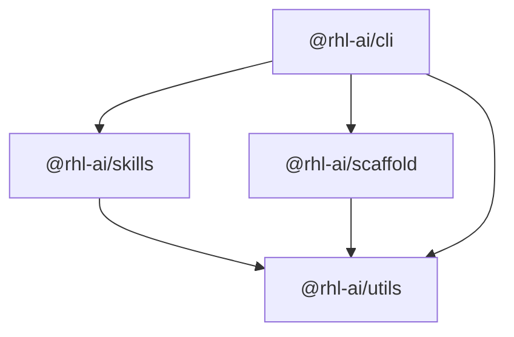

# RHL AI Architecture

## 1. Vision & Core Philosophy

RHL AI is an integrated monorepo ecosystem designed for:

- Developing and sharing robust **AI Agent Skills** and prompts.
- Publishing modular, high-quality **npm packages** under `@rhl-ai/*`.
- Rapidly generating boilerplate with **scaffolding templates**.
- Testing and iterating on internal **projects & experiments**.

## 2. Package Dependency Graph

### Layer Responsibilities

- **`@rhl-ai/utils`**: Primitive filesystem, logging, and environment detection functions. Zero non-standard dependencies.
- **`@rhl-ai/skills`**: Frontmatter parser, validation logic, discovery engine, and skill installer.
- **`@rhl-ai/scaffold`**: Project template discovery and code generation engine with variable interpolation.
- **`@rhl-ai/cli`**: The unified binary (`rhl`) providing interactive user commands.

## 3. Skills vs. Packages

A critical architectural distinction in RHL AI is that **Skills are not compiled packages**:

- Skills live in `skills/<skill-name>/` as markdown (`SKILL.md`) and supporting knowledge artifacts (`references/`, `examples/`, `scripts/`).
- They can be consumed directly by LLM context windows or installed into agent environments (such as `~/.agents/skills`).
- `@rhl-ai/skills` is the executable tool that inspects, validates, and installs them.

## 4. Release Engineering

- **Turborepo** caches and orchestrates compilation, linting, testing, and typechecking.
- **Changesets** handles independent semantic versioning and changelog management across all `@rhl-ai/*` packages.
- **GitHub Actions** enforces continuous integration and coordinates automated package releases.
